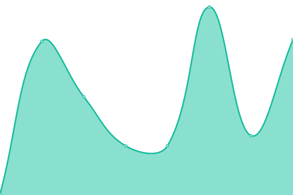
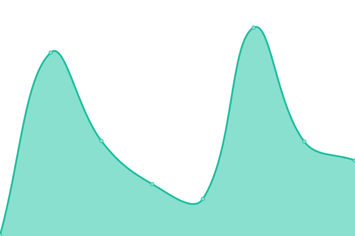
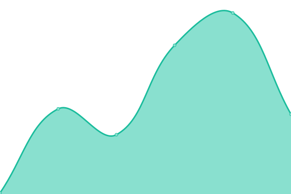
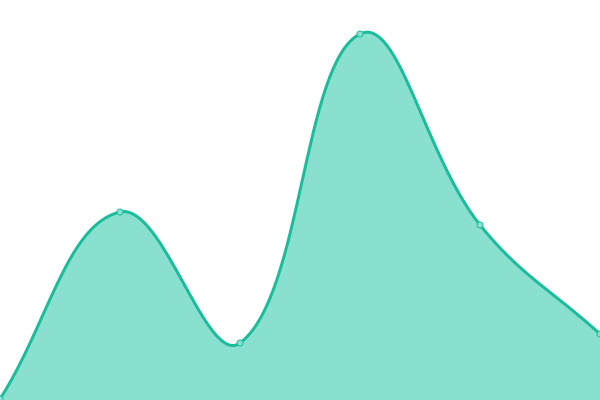
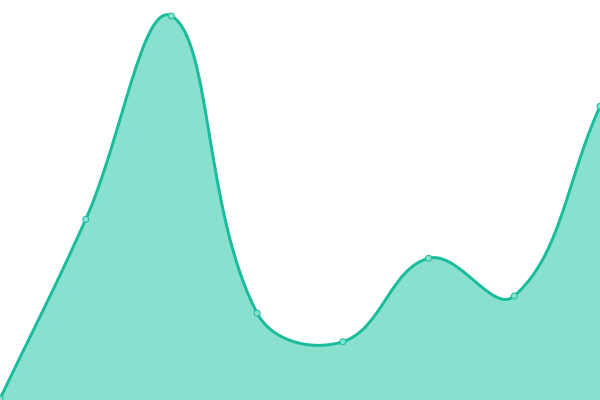
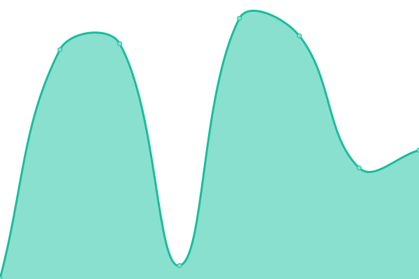

# [📈 Live Status](https://hexaghost-09.github.io/Uptime-Status): <!--live status--> **🟩 All systems operational**

This repository contains the open-source uptime monitor and status page for [HexaGhost-09](https://hexaghost-09.github.io/Uptime-Status), powered by [Upptime](https://github.com/upptime/upptime).

With [Upptime](https://upptime.js.org), you can get your own unlimited and free uptime monitor and status page, powered entirely by a GitHub repository. We use [Issues](https://github.com/HexaGhost-09/Uptime-Status/issues) as incident reports, [Actions](https://github.com/HexaGhost-09/Uptime-Status/actions) as uptime monitors, and [Pages](https://hexaghost-09.github.io/Uptime-Status) for the status page.

<!--start: status pages-->
<!-- This summary is generated by Upptime (https://github.com/upptime/upptime) -->
<!-- Do not edit this manually, your changes will be overwritten -->
<!-- prettier-ignore -->
| URL | Status | History | Response Time | Uptime |
| --- | ------ | ------- | ------------- | ------ |
|  [LinksPlace](https://linksplace.vercel.app) | 🟩 Up | [links-place.yml](https://github.com/HexaGhost-09/Uptime-Status/commits/HEAD/history/links-place.yml) | 

 119ms
     
 | 

<a href="https://GhostCircuit-X0.github.io/Uptime-Status/history/links-place">100.00%</a>
    

|  [Byte Notes Blog](https://byte-notes-blog.vercel.app) | 🟩 Up | [byte-notes-blog.yml](https://github.com/HexaGhost-09/Uptime-Status/commits/HEAD/history/byte-notes-blog.yml) | 

 144ms
     
 | 

<a href="https://GhostCircuit-X0.github.io/Uptime-Status/history/byte-notes-blog">100.00%</a>
    

|  [Nova Repacks Website](https://nova-repacks.vercel.app) | 🟩 Up | [nova-repacks-website.yml](https://github.com/HexaGhost-09/Uptime-Status/commits/HEAD/history/nova-repacks-website.yml) | 

 163ms
     
 | 

<a href="https://GhostCircuit-X0.github.io/Uptime-Status/history/nova-repacks-website">100.00%</a>
    

|  [Trim URL Eight Website](https://trim-url-eight.vercel.app) | 🟩 Up | [trim-url-eight-website.yml](https://github.com/HexaGhost-09/Uptime-Status/commits/HEAD/history/trim-url-eight-website.yml) | 

 142ms
     
 | 

<a href="https://GhostCircuit-X0.github.io/Uptime-Status/history/trim-url-eight-website">100.00%</a>
    

|  [Status Watch LOL](https://status-watch-lol.vercel.app) | 🟩 Up | [status-watch-lol.yml](https://github.com/HexaGhost-09/Uptime-Status/commits/HEAD/history/status-watch-lol.yml) | 

 121ms
     
 | 

<a href="https://GhostCircuit-X0.github.io/Uptime-Status/history/status-watch-lol">100.00%</a>
    

|  [TinyURL Server](https://tinyurl-server.deno.dev) | 🟩 Up | [tiny-url-server.yml](https://github.com/HexaGhost-09/Uptime-Status/commits/HEAD/history/tiny-url-server.yml) | 

 1762ms
     
 | 

<a href="https://GhostCircuit-X0.github.io/Uptime-Status/history/tiny-url-server">100.00%</a>
    

<!--end: status pages-->

[**Visit our status website →**](https://hexaghost-09.github.io/Uptime-Status)

## 📄 License

- Powered by: [Upptime](https://github.com/upptime/upptime)
- Code: [MIT](./LICENSE) © [Anand Chowdhary](https://anandchowdhary.com), supported by [Pabio](https://pabio.com)
- Data in the `./history` directory: [Open Database License](https://opendatacommons.org/licenses/odbl/1-0/)
